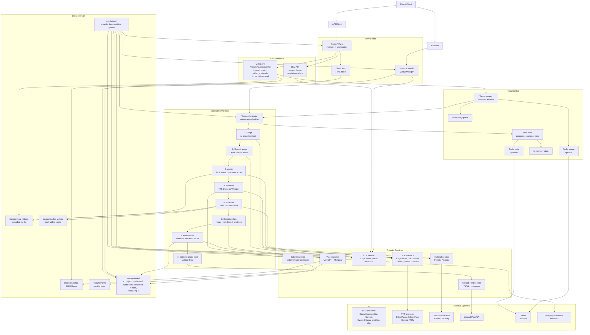

# MoneyPrinterTurbo Architecture Overview

MoneyPrinterTurbo is a Python application for generating short-form videos from a topic, prompt, custom script, custom audio, or local media. It can create the spoken script, search terms, narration audio, subtitles, background music, source clips, combined clips, final rendered videos, and optional social publishing metadata. It exposes the same generation engine through a FastAPI service and a Streamlit WebUI.

The main runtime is Python 3.11/3.12. The key libraries are FastAPI, Streamlit, MoviePy, FFmpeg, edge-tts, faster-whisper, OpenAI-compatible SDKs, Redis, and provider SDKs for selected LLM/TTS services.

## Entry Points

- `main.py`: starts the FastAPI app with Uvicorn.
- `app/asgi.py`: creates the FastAPI application, mounts generated task files under `/tasks`, mounts static public files, and wires global exception handling/CORS.
- `webui/Main.py`: Streamlit interface for configuring providers, writing/generating scripts, uploading local media/audio, selecting voice/BGM/subtitle/video options, and starting generation.
- `docker-compose.yml`, `Dockerfile`, `Dockerfile.gpu`: container deployment paths, including GPU-oriented deployment.

## What It Can Do

- Generate video scripts from a subject, language, paragraph count, custom user prompt, and optional custom system prompt.
- Generate search keywords for stock video retrieval.
- Generate social publishing metadata: title, caption, and hashtags for TikTok, YouTube Shorts, Instagram Reels, and Facebook Reels.
- Generate full short videos from AI-generated or user-provided scripts.
- Generate audio-only outputs.
- Generate subtitle-only outputs.
- Use custom uploaded audio instead of TTS.
- Run in no-voice mode by creating silent placeholder audio for the video timeline.
- Synthesize voices through Azure/edge TTS, Azure Speech, SiliconFlow, Google Gemini TTS, and Xiaomi MiMo TTS.
- Generate subtitles from TTS timing data or with faster-whisper fallback/correction.
- Render styled subtitles with font, size, color, stroke, position, background, and optional rounded background.
- Pull stock videos from Pexels or Pixabay, with API-key rotation and TLS verification.
- Use local video/image materials uploaded through API or WebUI.
- Convert still images into short zooming video clips.
- Support portrait 9:16, landscape 16:9, and API-level square 1:1 video aspects.
- Generate multiple video variants per task.
- Concatenate clips sequentially or randomly.
- Apply optional transitions: fade in, fade out, slide in, slide out, or shuffle.
- Mix narration with no/random/custom background music.
- Upload and list local BGM files.
- Upload and list local video/image materials.
- Stream and download generated video files.
- Track, list, query, and delete generation tasks.
- Queue tasks with configurable concurrency and queue size.
- Use in-memory state/queue by default or Redis-backed state/queue when enabled.
- Optionally auto-cross-post generated videos through Upload-Post to TikTok and Instagram.
- Configure many LLM providers: OpenAI, AIHubMix, Moonshot, Azure, Qwen, DeepSeek, Gemini, Grok, Ollama, g4f, OneAPI, Cloudflare, MiniMax, MiMo, ERNIE, ModelScope, Pollinations, and LiteLLM.
- Use software or hardware video encoders where available: libx264, NVENC, AMF, QSV, MediaFoundation, or VideoToolbox, with fallback to libx264.

Note: the WebUI currently shows TikTok, Bilibili, and Xiaohongshu as video source labels, but the backend downloader only has implemented branches for Pixabay and Pexels; unrecognized online source values fall back to the Pexels search path.

## API Surface

- `POST /videos`: create a full video generation task.
- `POST /subtitle`: create a subtitle-only task.
- `POST /audio`: create an audio-only task.
- `GET /tasks`: list tasks with pagination.
- `GET /tasks/{task_id}`: query task status and output URLs.
- `DELETE /tasks/{task_id}`: delete task state and generated files.
- `GET /musics`: list local BGM files.
- `POST /musics`: upload an MP3 BGM file.
- `GET /video_materials`: list local media materials.
- `POST /video_materials`: upload local video/image materials.
- `GET /stream/{file_path}`: stream generated videos with byte ranges.
- `GET /download/{file_path}`: download generated files.
- `POST /scripts`: generate only a script.
- `POST /terms`: generate only video search terms.
- `POST /social-metadata`: generate platform publishing metadata.

## Architecture Diagram

## Core Flow

1. A user starts a task from the WebUI or `POST /videos`.
2. The controller creates a task ID, stores initial state, and pushes work to a task manager.
3. The task manager starts immediately if concurrency allows, otherwise queues the task.
4. The task service generates or accepts the script.
5. For online stock sources, it generates search terms.
6. It creates narration audio with TTS, no-voice silent audio, or a custom uploaded audio file.
7. It creates subtitles from TTS timing or Whisper transcription/correction.
8. It fetches Pexels/Pixabay clips or preprocesses local videos/images.
9. It trims, resizes, orders, loops, and transitions clips to match audio duration.
10. It renders final videos with narration, optional BGM, and optional styled subtitles.
11. It updates task state with output paths and optionally cross-posts to TikTok/Instagram.
12. Generated files are served through `/tasks`, `/stream/{file_path}`, or `/download/{file_path}`.

## Important Source Map

- `app/controllers/v1/video.py`: task, upload, stream, download, BGM, and local-material endpoints.
- `app/controllers/v1/llm.py`: script, term, and social metadata endpoints.
- `app/services/task.py`: end-to-end generation orchestration.
- `app/services/llm.py`: LLM provider routing and prompt building.
- `app/services/voice.py`: TTS provider routing, no-voice mode, subtitle timing, audio duration.
- `app/services/subtitle.py`: faster-whisper subtitle generation and correction.
- `app/services/material.py`: Pexels/Pixabay search and video download/cache.
- `app/services/video.py`: local media preprocessing, clip combining, subtitle rendering, BGM mixing, final video encoding.
- `app/services/state.py`: in-memory or Redis task state.
- `app/controllers/manager/*.py`: queue/concurrency management.
- `app/services/upload_post.py`: optional Upload-Post cross-posting integration.
- `app/models/schema.py`: request/response models and video option enums.
- `app/config/config.py`: config loading, defaults, Docker/Ollama handling, FFmpeg/ImageMagick env setup.
